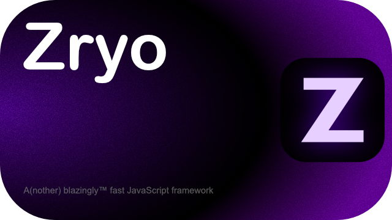

#  zyro.js

### Zyro is a fast, compiled, React-like JavaScript framework for building web applications.

Paired with Zyxi, the [cli](cli/), it has fast build times and fast runtime performance.

## This is kinda a meme
[There are too many JavaScipt frameworks](https://dayssincelastjavascriptframework.com/)

## License
© 2025 Thoq

© 2025 slqnt

This project uses the [MIT License](https://opensource.org/license/mit)
for more info, visit the [LICENSE](LICENSE.md) file.
